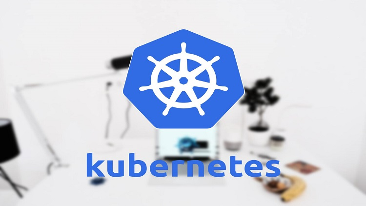

# Kubernetes Temelleri

Ayti.tech portalı olarak Türk bilişim çalışanlarının dil bariyerine takılmadan kendi dillerinde eğitim alabilmeleri için birçok önemli konuda eğitimler hazırlıyoruz. Bu eğitimlerden üçüncüsü olan "Kubernetes Temelleri” eğitiminde bilişim dünyasının son dönemlerde en önemli teknolojilerinden biri olan Kubernetes konusunu derinlemesine öğrenebilmenizi amaçlıyoruz. Eğitim sonunda katılımcıların "Kubernetes ile ilgili tüm temel bilgilere ve container olarak paketlenmiş uygulamaları Kubernetes platformunda çalıştırabilmek ve yönetmek için gerekli donanıma sahip olmaları” hedeflenmektedir.Bu github repository'si eğitimde kullanılan tüm dosyaların barındırılması için oluşturulmuştur.

# 

##  <a href="https://ayti.tech/k8s">İndirimli satın almak için tıklayınız...</a>

“Kubernetes Temelleri” eğitimi toplam 7 kısım altında 80 bölüm olarak tasarlandı. İlk giriş kısmında sizlere eğitim içeriği ve ön gereksinimlerle ilgili bilgiler sunuyor, ardından 2. Kısıma geçip biraz teorik ilerleyerek “Kubernetes nedir?” sorusuna bir cevap aramak başta olmak üzere Kubernetes mimarisi ile ilgili bilmemiz gereken ana başlıkları açıklıyoruz. Hemen ardından 3. kısımda ilk Kubernetes ortamımızı kurduktan sonra çeşitli kurulum yöntemlerini öğreniyoruz. Bunu takip eden 4 ve 5. bölümler ise eğitimin kalbi. Uygulamalarla pekiştirilmiş şekilde Kubernetes yapısını ve objelerini görüyoruz. Öğrenme kısmını tamamladıktan sonra 6. Kısımda tüm bu öğrendiklerimizi bir gerçek hayat senaryosu olarak uygulayacağız. Yani dağıtık mimarideki bir uygulamayı kendi kuracağımız production grade bir Kubernetes cluster üstünde koşturacak bir projeyi birlikte tamamlayacağız. Son 7 kısımda ise eğitim boyunca değinmediğimiz fakat bilinmesi gereken detayları öğrenecek ve eğitimi kapatacağız.