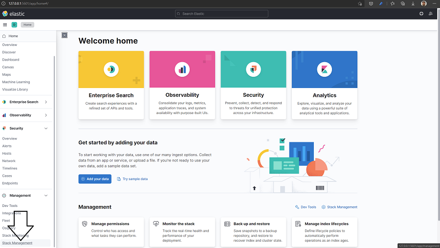
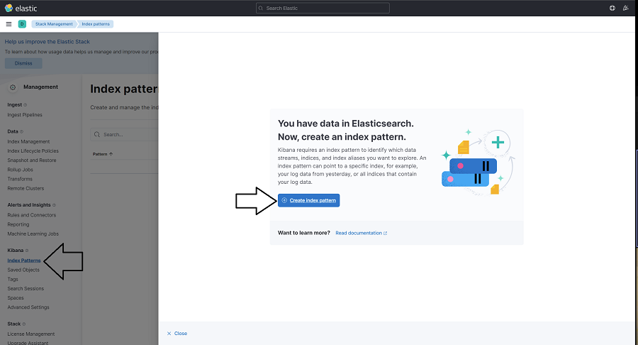
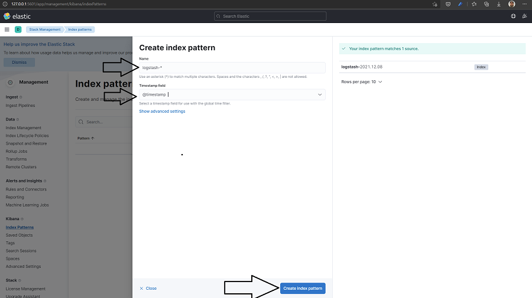
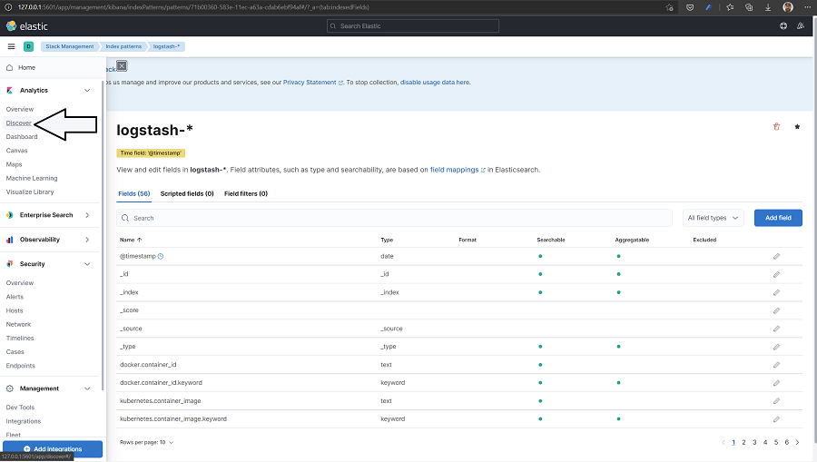
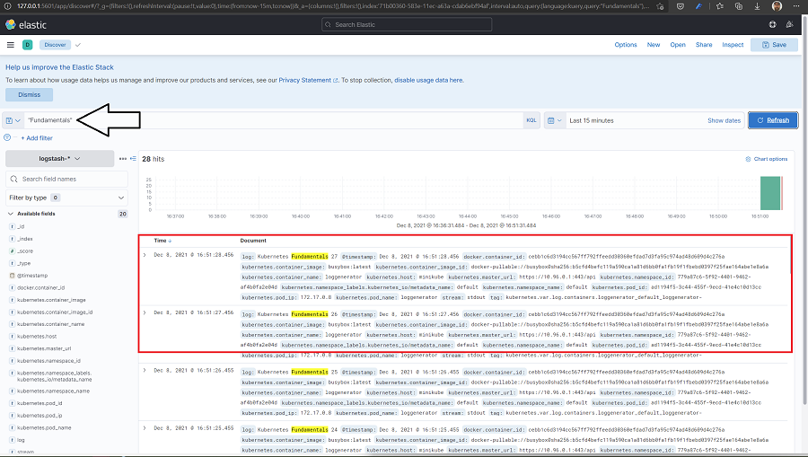

# Elasticksearch Fluentd Kibana stack
---- https://github.com/elastic/helm-charts

---- https://www.digitalocean.com/community/tutorials/how-to-set-up-an-elasticsearch-fluentd-and-kibana-efk-logging-stack-on-kubernetes
## Minikube


* Minikube çalıştır

```
$ minikube start --cpus 4 --memory 6144
```

* Minikube storage addon'larını devreye al

```
$ minikube addons enable default-storageclass
$ minikube addons enable storage-provisioner
```

* Log oluşturacak pod'u çalıştır

```
$ kubectl apply -f testpod.yaml
```

* efk isimli yeni bir namespace oluştur

```
$ kubectl create namespace efk
```

* elastichsearch deploy et
  
```
$ kubectl apply -f elastic.yaml
```

* rollout'un bitmesini bekle

```
$ kubectl rollout status sts/es-cluster --namespace=efk
Waiting for 3 pods to be ready...
Waiting for 2 pods to be ready...
Waiting for 1 pods to be ready...
partitioned roll out complete: 3 new pods have been updated...
```

* Elasticsearch'un düzgün çalıştığını kontrol et.

```
$ kubectl port-forward svc/elasticsearch 9200:9200 --namespace=efk
```

```
$ curl http://localhost:9200/_cluster/state?pretty
{
  "cluster_name" : "elasticsearch",
  "cluster_uuid" : "7cqcefAkTkuk7jJAjRaNSw",
  "version" : 17,
  "state_uuid" : "vsAEUSmVTlyFl5PLHIdcfw",
  "master_node" : "tMwUfjTjR_OYKAZMRn57ig",
  "blocks" : { },
  "nodes" : {
    "tMwUfjTjR_OYKAZMRn57ig" : {
      "name" : "elasticsearch-master-0",
      "ephemeral_id" : "747I-N1jQOCTvWQFnMyvpA",

      ...
```

* fluentd deploy et

```
$ kubectl apply -f fluentd.yaml
```

* kibana deploy et

```
$ kubectl apply -f kibana.yaml
```

* Fluentd ve kibana deploymentlarının tamamlanmasını bekle

* Kibana service'sini expose et

```
kubectl port-forward service/kibana -n efk 5601:5601
```

* Kibana'da index oluştur ve sorgulamayı dene
  

---

---

---

---



---
## Cloud


* Log oluşturacak pod'u çalıştır

```
$ kubectl apply -f testpod.yaml
```

* efk isimli yeni bir namespace oluştur

```
$ kubectl create namespace efk
```

* elastichsearch deploy et
  
```
$ helm repo add elastic https://helm.elastic.co
$ helm repo update
$ helm install elasticsearch elastic/elasticsearch --namespace efk
```

* rollout'un bitmesini bekle

```
$ kubectl rollout status sts/elasticsearch-master --namespace=efk
Waiting for 3 pods to be ready...
Waiting for 2 pods to be ready...
Waiting for 1 pods to be ready...
partitioned roll out complete: 3 new pods have been updated...
```

* Elasticsearch'un düzgün çalıştığını kontrol et.

```
$ kubectl port-forward svc/elasticsearch-master 9200:9200 --namespace=efk
```

```
$ curl http://localhost:9200/_cluster/state?pretty
{
  "cluster_name" : "elasticsearch",
  "cluster_uuid" : "7cqcefAkTkuk7jJAjRaNSw",
  "version" : 17,
  "state_uuid" : "vsAEUSmVTlyFl5PLHIdcfw",
  "master_node" : "tMwUfjTjR_OYKAZMRn57ig",
  "blocks" : { },
  "nodes" : {
    "tMwUfjTjR_OYKAZMRn57ig" : {
      "name" : "elasticsearch-master-0",
      "ephemeral_id" : "747I-N1jQOCTvWQFnMyvpA",

      ...
```


* Fluentd deploy et

```
$ kubectl apply -f fluentd.yaml
```

* kibana deploy et

```
$ helm install kibana elastic/kibana --set env.ELASTICSEARCH_URL=http://elasticsearch-master:9200 --namespace efk
```

* Fluentd ve kibana deploymentlarının tamamlanmasını bekle

* Kibana service'sini expose et

```
kubectl port-forward service/kibana-kibana -n efk 5601:5601
```
* Kibana'da index oluştur ve sorgulamayı dene
  

---

---

---

---

